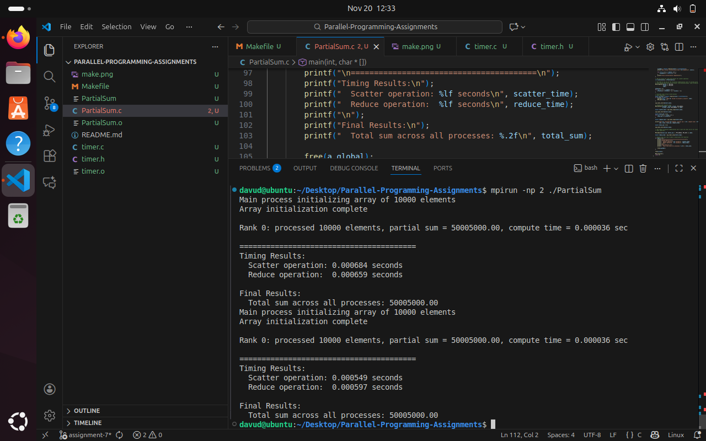
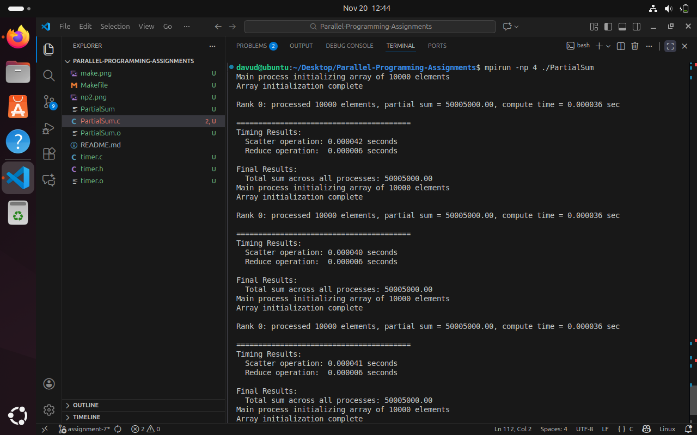
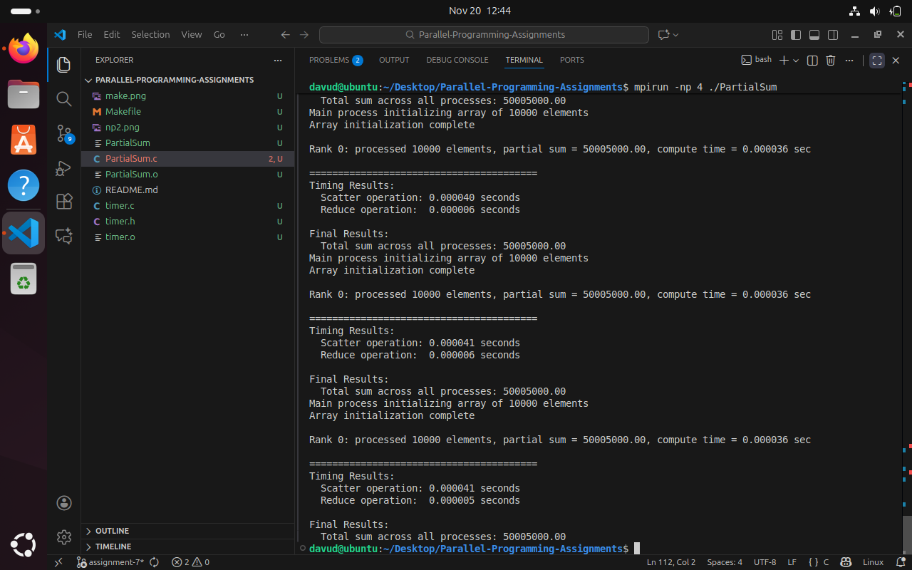
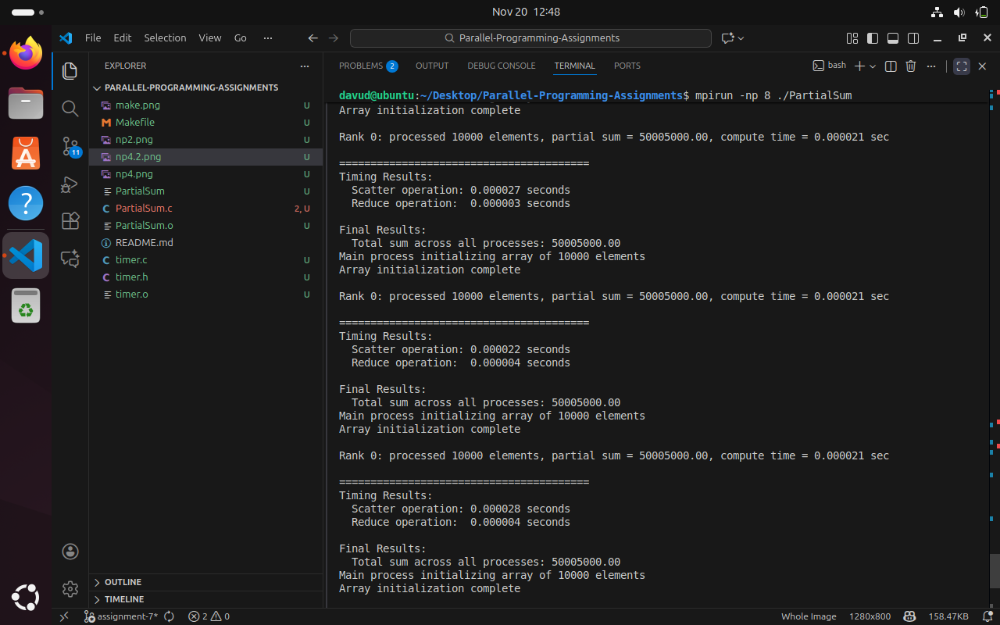
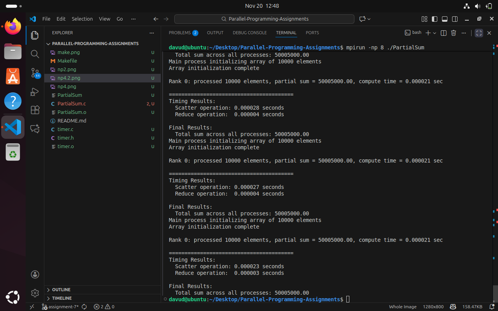

# Parallel-Programming-Assignments

***Code Explanation***
- MPI_Allgather: This function is used to gather the size of the local arrays from all processes. It helps each process know how many elements it will receive and where its data starts in the global array.

- MPI_Scatterv: This function distributes parts of the global array to each process based on the calculated sizes and offsets. It makes sure each process gets its designated chunk.

- MPI_Reduce: This function collects the partial sums from all processes and computes the total sum. The root process (rank 0) will receive the final result.

- To correctly divide the work, I calculate the size each process will handle:
    int base = ncells / nprocs;
    int rem = ncells % nprocs;
    int nsize = base + (rank < rem ? 1 : 0);
    int start = rank * base + (rank < rem ? rank : rem);
Here, base is the number of elements each process gets, and rem is the extra work that gets distributed to the first few processes.

- Why only rank 0 needs to deallocate: Rank 0 is the only process that allocated the global array (a_global) using malloc. Since only the process that allocated memory is responsible for freeing it, rank 0 must deallocate the global array, while other ranks only free their local memory.

***Pictures***

