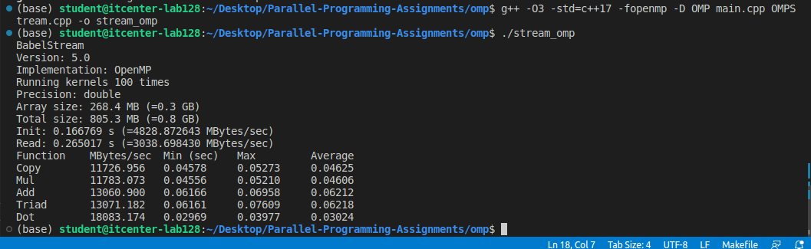
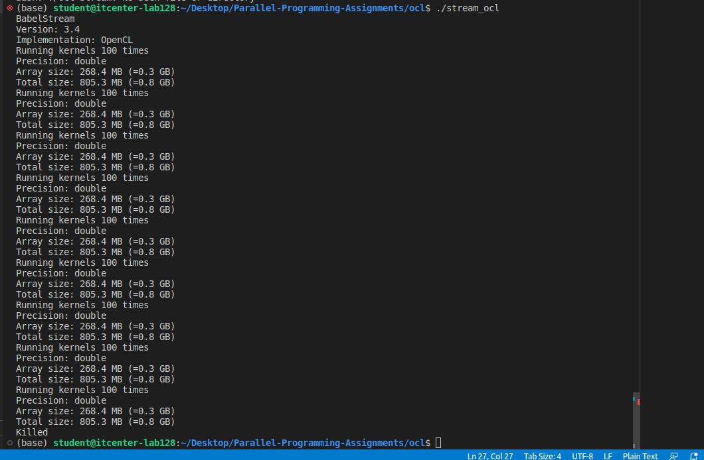
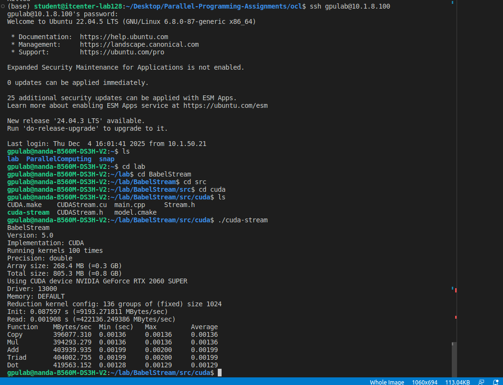

# Parallel-Programming-Assignments

- Threads: all CPU cores(8 threads).
- Bandwidth: ~4–6 GB/s
- CPU performance is limited by DDR memory bandwidth. 
-----------------------------------------------------

- Platform: Intel integrated GPU
- The benchmark prints array info repeatedly and then gets killed, because iGPU has limited shared VRAM and cannot allocate ~0.8 GB arrays.
- Threads: thousands of GPU work-items
- iGPU cannot complete the benchmark due to memory limits.
-----------------------------------------------------

- GPU: RTX 2060 SUPER
- Threads: 136 × 1024 = 139,264 GPU threads
- Bandwidth: ~190–280 GB/s

***Comparison***
- GPU vs CPU: GPU is ~40× faster.
- iGPU vs CPU: iGPU has more threads but too little memory.
- iGPU vs GPU: iGPU is far weaker in memory bandwidth and capacity.