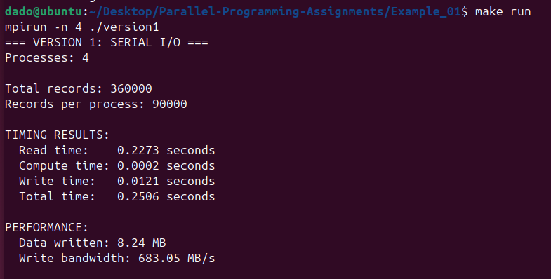
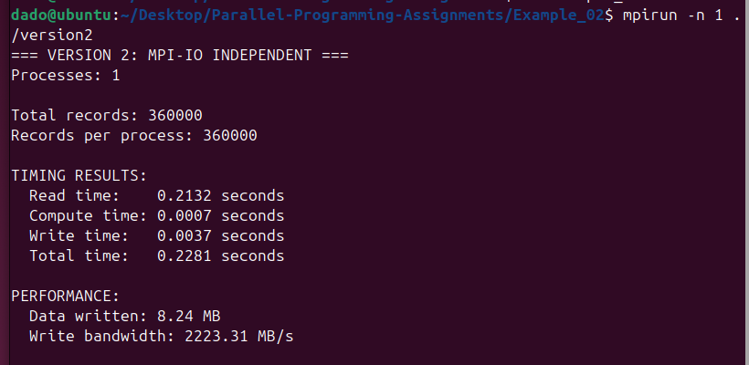
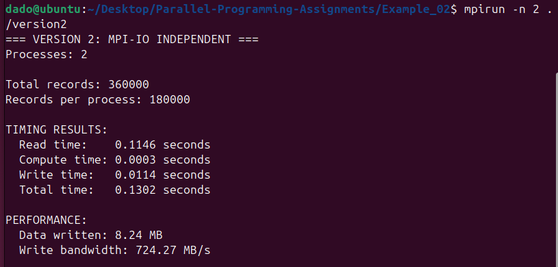
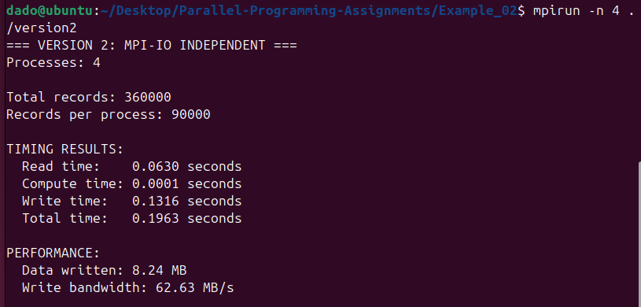
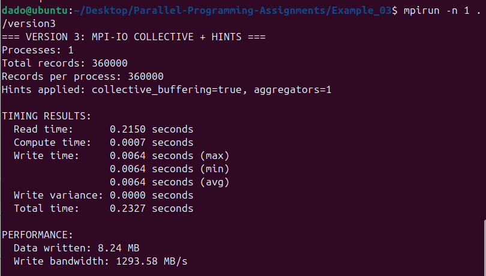
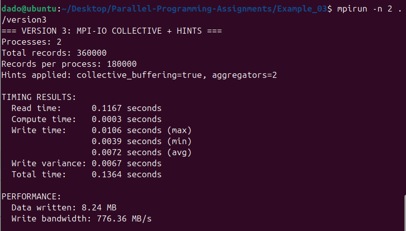
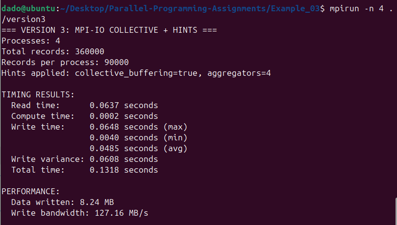

# Parallel-Programming-Assignments

***Example 1***

***Example 2***

***Example 3***

***Elaborate on what are the main differences between executions***

- The main difference between executions lies in how file I/O is performed.
- In Example 01, all file reading and writing is done by rank 0, while other processes remain idle during I/O.
- In Example 02, each process independently reads and writes its own portion of the data using MPI-IO.
- In Example 03, collective MPI-IO operations are used, where processes coordinate file access through file views and collective writes with performance hints.

***Explain what is the difference between execution times***

- Execution times differ due to the I/O strategy used.
- Example 01 shows the highest total execution time because all I/O operations are serialized on a single process.
- Example 02 achieves lower execution times as the number of processes increases, since I/O work is distributed across processes.
- Example 03 has similar or slightly higher overhead for small datasets on a virtual machine due to collective coordination, but still performs better than serial I/O.

***Explain why is there drastic difference between Example_01 and Example_02/Example_03***

- The drastic performance difference occurs because Example 01 uses serial file I/O, creating a bottleneck at rank 0 in both memory usage and I/O operations.
- All data must be gathered and written by a single process, which limits scalability.
- In contrast, Example 02 and Example 03 allow multiple processes to perform I/O in parallel, eliminating the central bottleneck and improving performance.

***Explain what Example_03 brings in terms of improvements***

- Example 03 introduces collective MPI-IO with performance hints such as collective buffering and the use of aggregator processes.
- These optimizations reduce the number of small write operations and improve I/O efficiency on large-scale parallel systems.

***Compare Example_02 and Example_03 and explain when Example_03 is better***

- Example 02 uses independent MPI-IO and performs very well on small datasets and local virtual machines, as it has minimal coordination overhead.
- Example 03 introduces synchronization and aggregation overhead, which can reduce performance on small systems.
- However, Example 03 is more suitable for large datasets, many processes, and parallel filesystems, where collective buffering and aggregation significantly improve overall I/O throughput.

