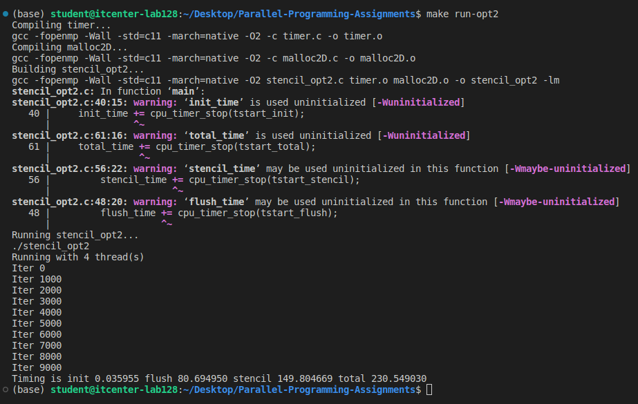
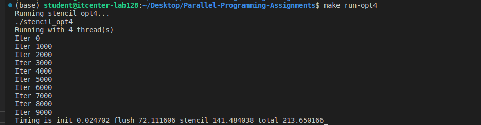
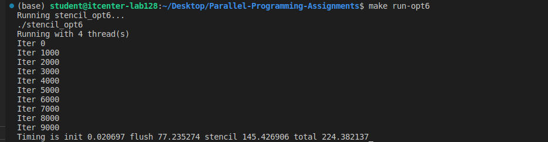

# Parallel-Programming-Assignments

- Stencil_opt2: Each loop is separately parallelized. Its creating a new parallel region for every iteration, that means its higher overhead. Flush and stencil computations are a bit worse for cache.

- Stencil_opt4: Parallel region covers the whole iteration loop. Reduces parallel overhead and only thread 0 handles timing and swaps. Slightly better cache usage and faster than opt2.

- Stencil_opt6: Threads work on fixed blocks of rows and flush indices. Minimizes overhead, maximizes cache efficiency, and uses barriers to synchronize. Fastest and most scalable.

***How many threads your CPU used to execute the code?***
- My CPU used 4 threads.

***What are the parts of the code that were improved? What strategies were used to improve the code?***
- The main improvement occurred between version 2 and version 4, where the code was changed to use one long parallel region instead of creating new threads in every loop, which reduced the fork-join overhead and made execution smoother. The next improvement from version 4 to version 6 came from dividing the work manually among threads, improving memory access and reducing synchronization time. These changes made the program run more efficiently and scale better with more threads.

***What is the difference between explicit and implicit barriers inside the code and did they exist inside any of these examples? What do they actually mean?***
- Implicit barriers make all threads wait automatically at the end of #pragma omp for loops. Explicit barriers #pragma omp barrier are manually added to make threads wait at specific points. Stencil_opt2 and Stencil_opt_4: implicit barriers; Stencil_opt6: implicit and explicit barriers.

***Results***
Running stencil_opt2...
./stencil_opt2
Running with 4 thread(s)
Iter 0
Iter 1000
Iter 2000
Iter 3000
Iter 4000
Iter 5000
Iter 6000
Iter 7000
Iter 8000
Iter 9000
Timing is init 0.035955 flush 80.694950 stencil 149.804669 total 230.549030

Running stencil_opt4...
./stencil_opt4
Running with 4 thread(s)
Iter 0
Iter 1000
Iter 2000
Iter 3000
Iter 4000
Iter 5000
Iter 6000
Iter 7000
Iter 8000
Iter 9000
Timing is init 0.024702 flush 72.111606 stencil 141.484038 total 213.650166

Running stencil_opt6...
./stencil_opt6
Running with 4 thread(s)
Iter 0
Iter 1000
Iter 2000
Iter 3000
Iter 4000
Iter 5000
Iter 6000
Iter 7000
Iter 8000
Iter 9000
Timing is init 0.020697 flush 77.235274 stencil 145.426906 total 224.382137