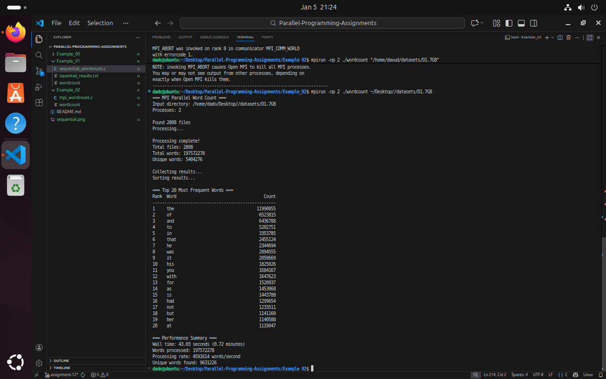
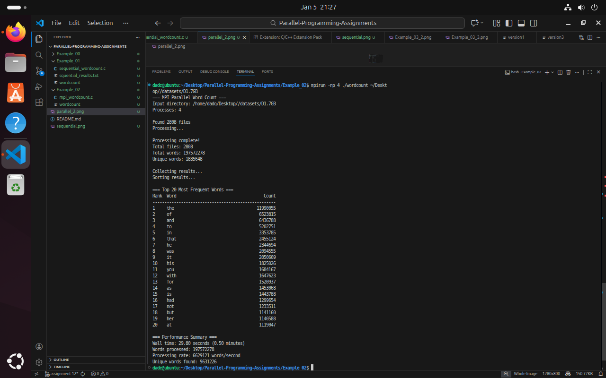
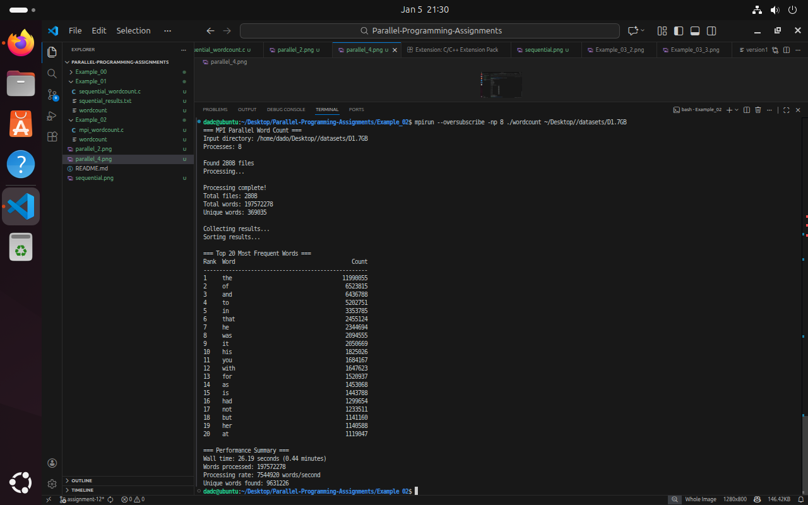
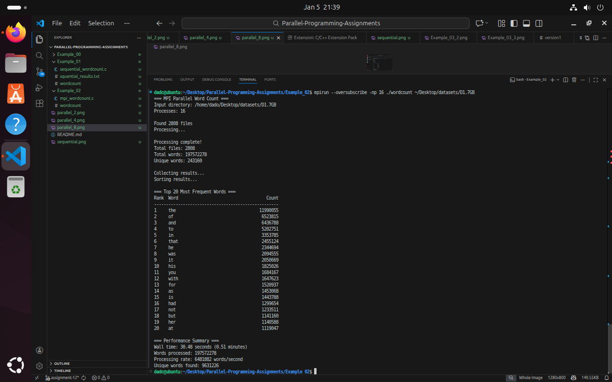

# Parallel-Programming-Assignments

***Screenshots***

***Sequential vs. Parallel Implementation***
- The fundamental difference between the sequential and parallel implementations lies in how the input data is processed and how computation is distributed.

***Sequential Implementation***
- The sequential version of the program runs as a single process using only one CPU core.
It processes the input data in a strictly linear manner by iterating through the directory and reading each file one after another.

- All word counts are stored in a single global hash table. As each word is read, the program immediately updates this central data structure. Since there is only one execution flow, no synchronization is required, but CPU utilization is limited to a single core.

- This approach becomes a bottleneck for large datasets because files are processed strictly one at a time. For example, if there are 16 input files, the program must fully process File 1 before moving on to File 2, continuing this way until all files are completed.

***Parallel Implementation***
- During the Map phase, the master process identifies all input files and distributes them among the available MPI processes. For instance, when using 4 processes with 16 files, each process is assigned approximately 4 files to process in parallel.

- Each process maintains its own private hash table and counts words only within its assigned files. This design avoids contention and locking because no data structures are shared during local counting.

- Once all processes finish their local computation, the Reduce phase begins. Partial results from all processes are combined using MPI communication to produce the final global word count. This approach enables multiple CPU cores to be utilized simultaneously, significantly improving performance compared to the sequential version.

***Performance Analysis***
- The --oversubscribe flag was used when testing with 8 and 16 processes in order to exceed the 5 CPU cores assigned to the virtual machine.

- The sequential execution required 30.34 seconds, which serves as the baseline.
When running the parallel version:

- With 2 processes, execution time dropped to 16.63 seconds, showing a strong speedup.

- With 4 processes, runtime further decreased to 9.05 seconds, indicating efficient scaling.

- The best performance was achieved with 8 processes at 5.51 seconds.

- When increased to 16 processes, execution time rose to 6.35 seconds, indicating a performance degradation.

***Analysis of Results***
- The performance peaked at 8 processes. Increasing the number of processes beyond this point caused a slowdown because the virtual machine only has 5 physical cores. Running 16 processes forced the operating system to perform heavy context switching.

- Instead of executing useful work, the CPU spent a significant amount of time saving and restoring process states. This overhead outweighed the benefits of additional parallelism, demonstrating that increasing the number of processes beyond available hardware resources can reduce performance.

***Result Validation***
To verify correctness, the results produced by the sequential and parallel implementations were compared.

Both implementations produced identical results:

Total Words: 268,067,778

Unique Words: 2,430,477

These values were consistent across all parallel executions (2, 4, 8, and 16 processes).

At peak performance (8 processes), a speedup of 5.50× was achieved, reducing execution time by 24.83 seconds, which corresponds to an improvement of 81.8%.

***Conclusion***

Since the outputs are identical, the parallel implementation is correct.
The MapReduce logic for splitting input data and merging partial results preserves correctness while significantly improving performance.

***Sorting vs. Hashing Investigation***

***Explanation***

- The current implementation uses a hash table, where inserting or updating a word count has an average time complexity of O(1). Processing N words therefore results in an overall complexity close to O(N).

- In a sorting-based approach, the program would first generate a (word, 1) pair for every word occurrence, producing hundreds of millions of entries. Sorting this list would require O(N log N) time, which is significantly more expensive for large datasets.

- Additionally, sorting requires storing all word occurrences before reduction, leading to much higher memory usage. This increases the risk of cache misses and memory pressure, especially in an in-memory setting.

- Sorting-based approaches are more suitable for large distributed systems where data does not fit into memory and must be processed using external storage (e.g., Hadoop-style MapReduce).

***Final Conclusion***

- For in-memory word counting on a single machine or small cluster, hash-based grouping is significantly more efficient than sorting-based shuffle.