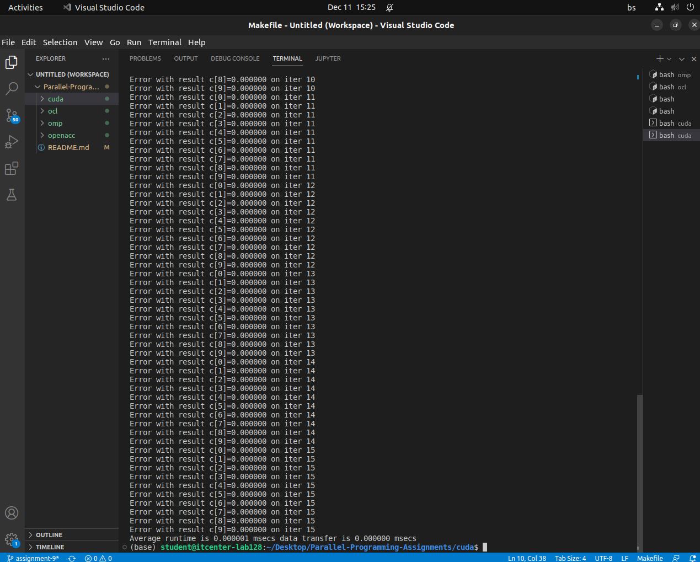
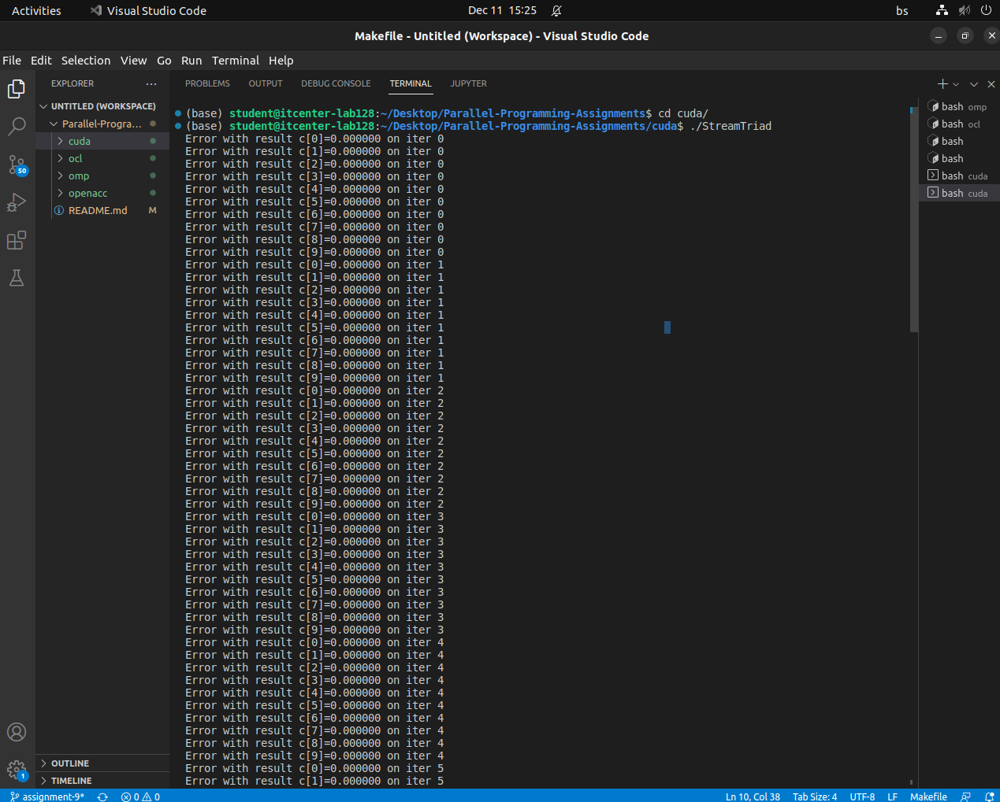
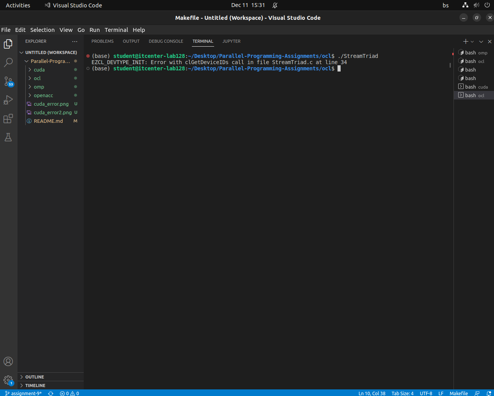
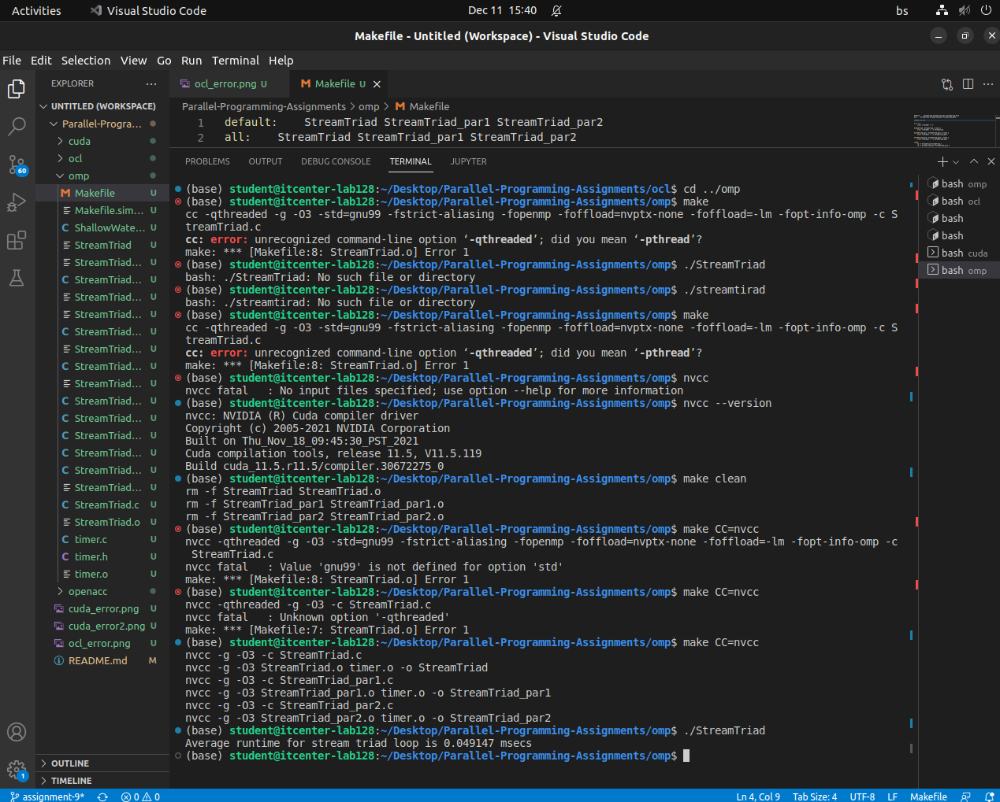
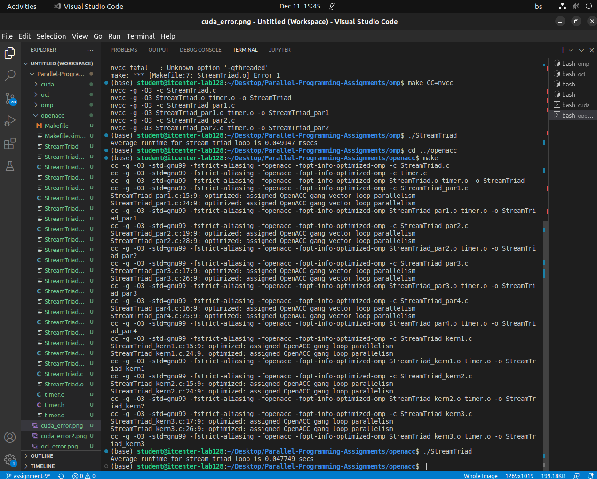
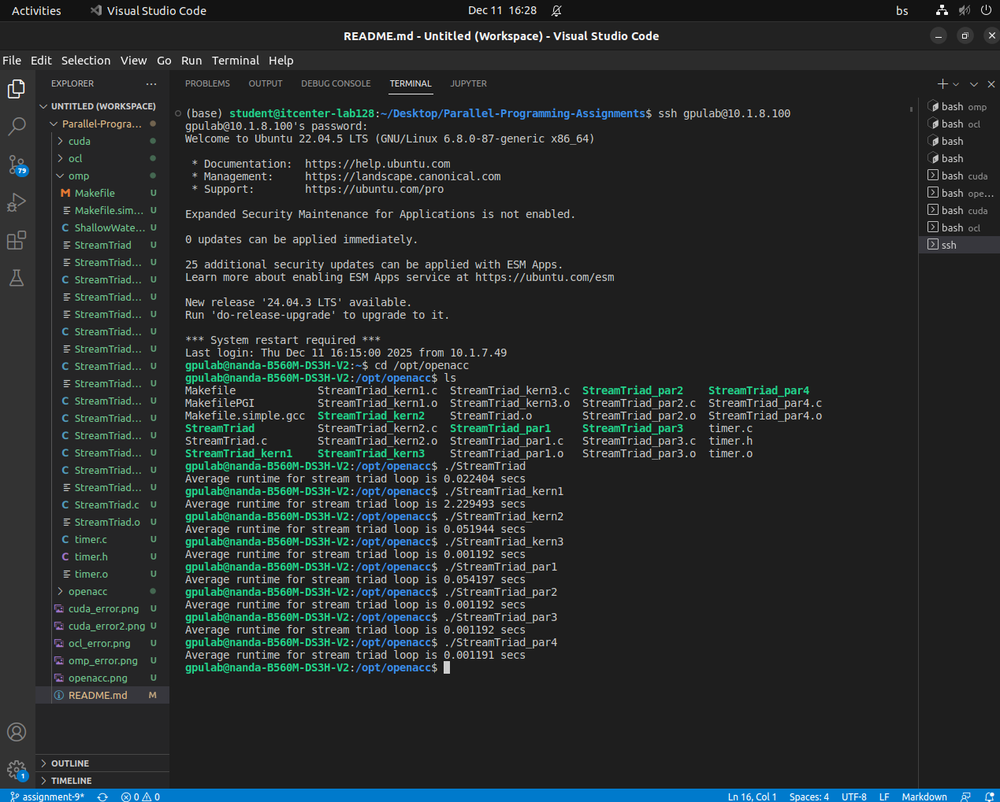

# ParallelComputing

***CUDA***

- The CUDA version failed because all GPU results were 0.000000, which shows that the GPU never processed properly initialized data. The extremely small kernel runtime indicates that no real computation happened, the kernel launched but didn’t actually perform any work. As a result, every iteration produced incorrect output without any reported CUDA errors.

***OCL***

- The OpenCL program failed because clGetDeviceIDs returned an error. No suitable device was found or the device didn’t meet the required capabilities, so initialization stopped and no computation was performed.

***OMP***

- The code did not run at first because the Makefile contained an old invalid compiler option "-pthread", which the compiler does not recognize. Because of that error, the build failed and no executable was created. Then I tried compiling with "nvcc", but that also failed because "nvcc" does not support some of the GCC-specific flags used in the Makefile. After I deleted those specific flags and got left only with -g -03 the code successfully was executed.

***OPENACC***

- OpenACC ran successfully because it uses high-level directives that automatically manage device setup and data movement, so it can run even without GPU by falling back to a valid CPU path. Average runtime is 0.041501.

- OpenACC on the server produced different runtimes because each executable was compiled with slightly different directives, which generated different GPU or CPU karnels. Since OpenACC hides device managment and applies various optimizations depending on the pragma structure, performance naturally varies. Among the versions, par4 turned out to be the fastest. Kern1 turned to be the slowest because it failed to parallelize the loops and had worst runtime.
