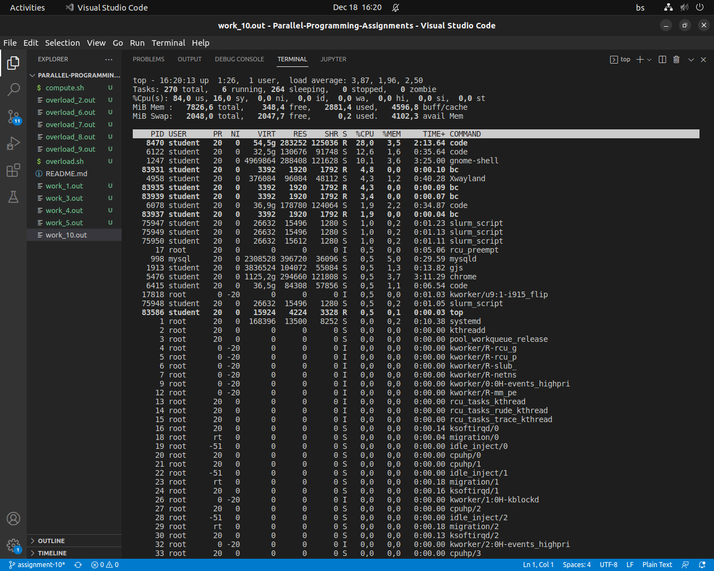
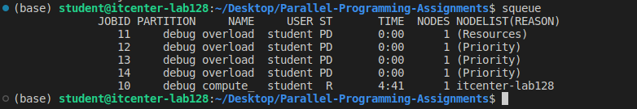
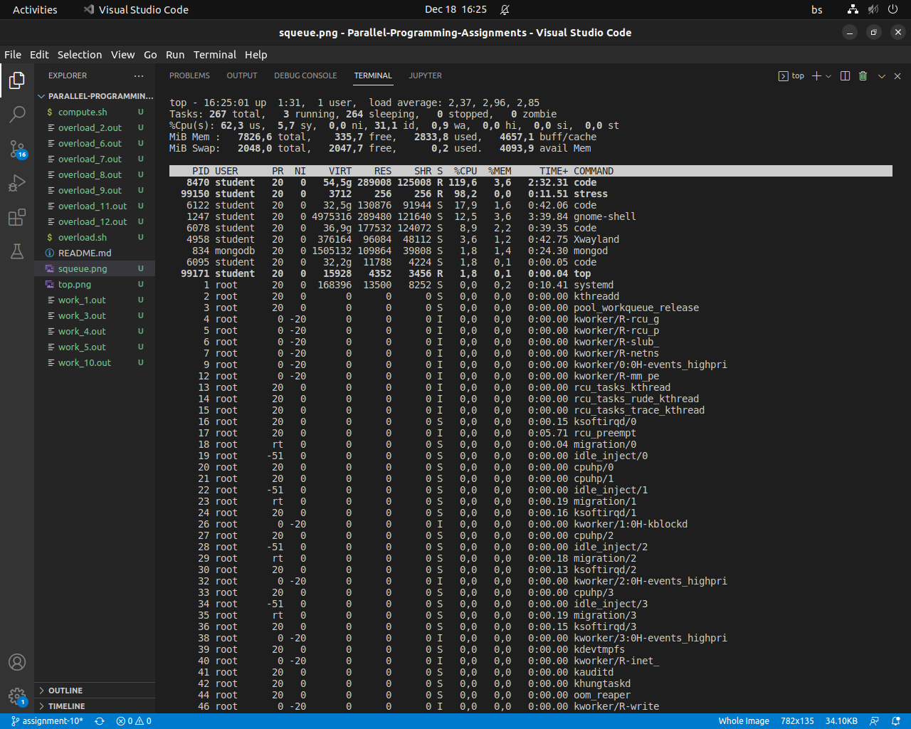
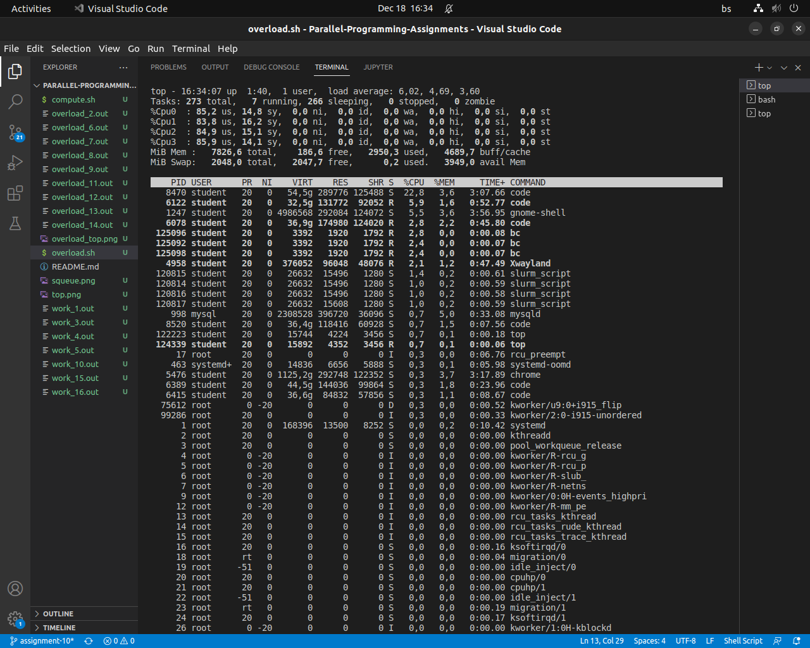
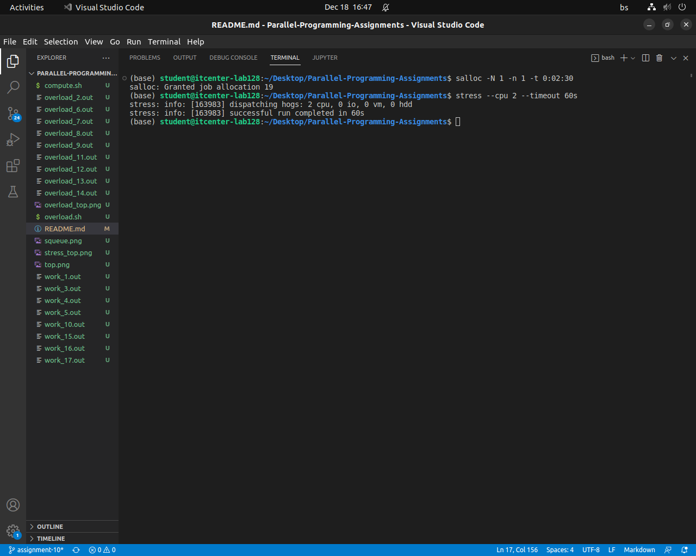

# Parallel-Programming-Assignments

***ompute.sh test***
- Script executed 4 times using sbatch
- Each job requested 4 CPUs

***overload.sh with slurm***
- Stress executed via sbatch
- Slurm handled resource allocation correctly

***overload.sh without slurm*** 
- Without Slurm, both stress processes compete for the same CPU resources, causing oversubscription, system slowdown, and lack of fair resource allocation.

***salloc test***
- Allocated 1 CPU
- stress --cpu 2 and --cpu 4 caused oversubscription
- Demonstrates importance of scheduler

